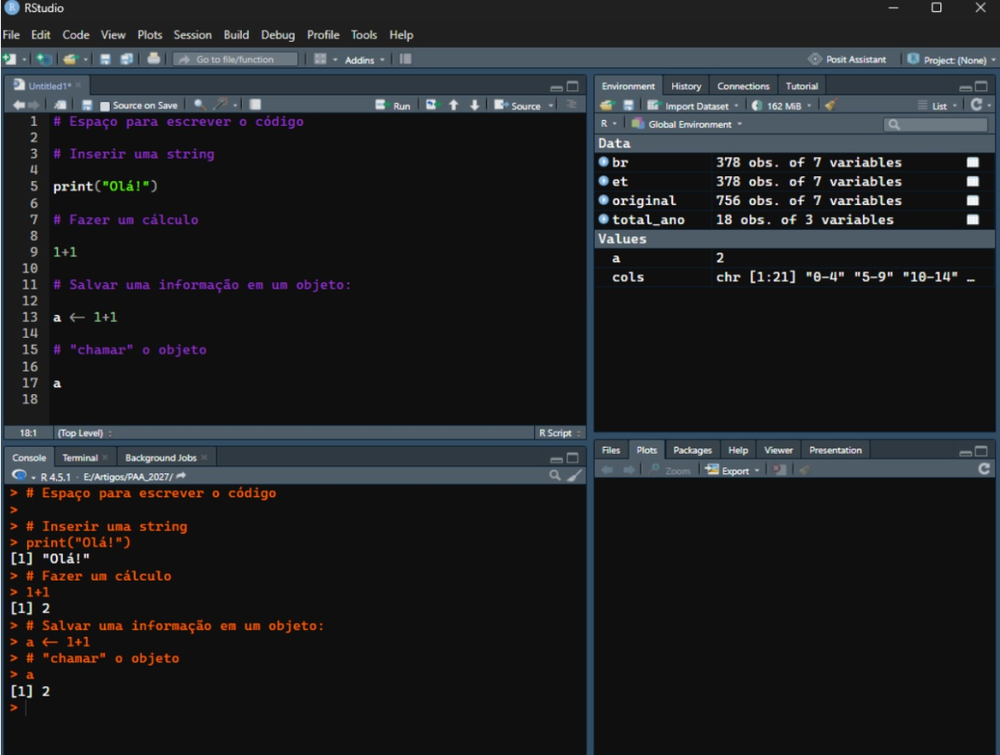

# 1 O que é o R e o que ele faz

R é um software livre para realizar tratamento e análise de dados e gráficos.  Suas principais funções incluem a análise estatística, como modelagem linear e não linear, testes estatísticos clássicos, análise de séries temporais, classificação, clusterização, dentre outros. Suas funções gráficas também são largamente utilizadas, sobretudo para apresentar os resultados do tratamento e manipulação dos dados.

## **Interface do R Studio**

O RStudio é um programa que proporciona um ambiente para desenvolvimento de trabalhos com o R. A apresentação mais geral do RStudio passa pela divisão principal em quatro setores do ambientes:

O primeiro, à esquerda na parte superior, é onde escreve-se o código para importar, organizar, transformar os dados, dentre outras possibilidades. Por exemplo, na Figura 1 a linha 5 insere o comando “print(“Olá!”)”, o que indica ao programa que queremos que o resultado dessa coluna seja a palavra “Olá!”. O quadro à esquerda na parte inferior é onde os resultados aparecem. Com isso, a primeira linha em branco nesta seção apresenta o resultado da linha 5 do ambiente na parte superior à esquerda: “Olá!”.



A parte superior direita apresenta os objetos e valores já criados e salvos. Por exemplo, br é uma base de dados com 378 observações ou linhas e 7 variáveis, ou colunas. No exemplo da Figura 1 temos a criação de um objeto chamado “a” e seu valor é o resultado de 1+1. A linha 13 do quadro que escreve o código cria o objeto e a linha 17 retorna o valor desse objeto - muitas vezes fala-se que estamos “chamando” o objeto (call). 

Por fim, o último quadro, na parte inferior à direita, apresenta os plots criados, mais comumente os gráficos. Neste caso não há nenhum plot criado e por isso a seção está vazia. É importante perceber que cada seção tem várias opções e sub-seções. No caso deste quadro de plots, pode-se abrir a subpasta “Packages” para verificar os pacotes que já estão em funcionamento na sua versão do R.\

# **2 Tipos de variáveis**

Os objetos no R são separados por tipos de variáveis, os quais permitem manipulações e operações específicas. Em geral, é importante que o tipo da variável esteja correto para que as transformações e manipulações dos dados sejam realizadas. A tabela a seguir indica quais são os tipos básicos de variáveis, seu formato e alguns exemplos.

|  |  |  |
|:----------------------:|:----------------------:|:----------------------:|
| **Tipo** | **Formato** | **Exemplos** |
| Integer | Números inteiros | 1, 2, 3, 1000, -1000 |
| Numeric | Números decimais, com ponto como separador  | 0.1, 0.599. 1.0000 |
| Character | Textos | “Olá!”, “1000”, “15/19” |
| Logical | Valores Booleanos. Valores que são falsos ou verdadeiros | TRUE, FALSE |
| Factor | Categóricos. Objetos que tenham alguma ordem definida. | “Jan”, “Fev”,"Mar" |
| Vector | Coleção de objetos em 1D | Uma lista com todos os nomes de meses ou com a ordem da Faixa Etária na ordem desejada |
| Matrix | Coleção de objetos do mesmo tipo em 2D | Matriz de origem-destino migratória |
| Data.frame | Coleção de objetos de tipos diferentes em 2D | Base de Dados do SIM ou do SINASC, com diferentes colunas para diferentes informações e cada linha é um indivíduo ou observação. |
| Missing | Valor lógico | NA |
| Empty | \~vazio\~ | NULL |

: Tabela 1 - Tipos de variável, formato e exemplos

Para identificar qual tipo de variável é o objeto de interesse, podemos utilizar o começando class(), como abaixo. Ao chamar class() identificamos que o tipo da variável *a* é *numeric*

```{r}
#| label: conferir-tipo-de-variável

a <- 1+1
class(a)
```

## Operações numéricas

Podemos utilizar as operações numéricas principalmente nos tipos numeric e integer, realizando contas entre números ou transformando objetos. Alguns exemplos são dados abaixo.

```{r}
# Soma

1 + 1

# Subtração

a-a

# Divisão

1/1000

a/2

# Multiplicação

a*5

# Potência

a^2

# Radicialização

a^(1/2)

4^(1/2)

27^(1/3)

sqrt(4) # Especificamente para raiz quadrada
```

Algumas funções de arrendondamento também são muito úteis. Vamos utilizar o número pi como exemplo. No R, o pi já é uma palavra reservada por si só. Mesmo não tendo criado um objeto *pi* o programa já o identifica:

```{r}
pi
```

Assim, podemos transformá-lo com os arrendondamentos:

```{r}
# a função round() arrendonda para o inteiro mais próximo
# podemos entender melhor essa função com ?round() no R

round(pi) 

# o arugmento digits possibilita manter o número de casas decimais que queremos
round(pi, digits = 2)

# Mas também pode ser suprimido o nome do argumento
round(pi, 2)

# floor() retorna o valor inteiro mais próximo abaixo do valor de interesse
floor(pi)

# ceiling() retorna o valor inteiro mais próximo acima do valor
ceiling(pi)

```

## Operações de comparação

De modo simples, podemos utilizar as operações de comparação para dois objetos:

```{r}
# Criando duas variáveis
x <- 10
y <- 5

# Igual a
x == y

# Diferente de
x != y 

# Maior que / Menor que
x > y  
x < y  

# Maior ou igual / Menor ou igual
x >= y
x <= 2*y 

# Percebam que todos os resultados acima são valores lógicos ou booleanos (True/False)
class(x)
class(y)
class(x <= y)
```

Esse processo de comparação é importante para juntar informações de duas bases, como veremos em Relacionamentos. Uma aplicação mais simples é a definição da faixa etária do indivíduo a partir da sua idade. Pense em uma tabela com duas colunas:

idade_num: Idade (em anos completos)\
Total: Número de pessoas com essa idade\

O código abaixo é a criação de uma terceira coluna chamada faixa_etaria, que identifica a faixa etária daquela idade. Com isso, poderemos agrupo o Total por faixa etária posteriormente. Note que essa nova coluna é criada a partir da comparação entre a idade simples (coluna idade_num) e os valores indicados em cada linha.

```{r}
#| eval: false

faixa_etaria = case_when(
  idade_num == 0 ~ "0 a 1 ano",
  idade_num >= 1  & idade_num <= 4  ~ "1 a 4 anos",
  idade_num >= 5  & idade_num <= 9  ~ "5 a 9 anos",
  idade_num >= 10 & idade_num <= 14 ~ "10 a 14 anos",
  idade_num >= 15 & idade_num <= 19 ~ "15 a 19 anos",
  idade_num >= 20 & idade_num <= 24 ~ "20 a 24 anos",
  idade_num >= 25 & idade_num <= 29 ~ "25 a 29 anos",
  idade_num >= 30 & idade_num <= 34 ~ "30 a 34 anos",
  idade_num >= 35 & idade_num <= 39 ~ "35 a 39 anos",
  idade_num >= 40 & idade_num <= 44 ~ "40 a 44 anos",
  idade_num >= 45 & idade_num <= 49 ~ "45 a 49 anos",
  idade_num >= 50 & idade_num <= 54 ~ "50 a 54 anos",
  idade_num >= 55 & idade_num <= 59 ~ "55 a 59 anos",
  idade_num >= 60 & idade_num <= 64 ~ "60 a 64 anos",
  idade_num >= 65 & idade_num <= 69 ~ "65 a 69 anos",
  idade_num >= 70 & idade_num <= 74 ~ "70 a 74 anos",
  idade_num >= 75 & idade_num <= 79 ~ "75 a 79 anos",
  idade_num >= 80 ~ "80 anos e mais",
  TRUE ~ as.character(`idade_num`)
)
```

## Transformações de texto

Os textos são largamente identificados no R como character. Em outras linguagem também chama-se de string, outro nome bastante comum para os objetos de texto. Para apresentar algumas transformações e manipulações de texto no R vamos utilizar o padrão de município que vem no Sistema de Informações de Mortalidade (SIM) do DataSUS.

```{r}
# Salvar a informação em um objeto

campinas_codIBGE <- "350950 CAMPINAS"

# Contar caracteres

nchar(campinas_codIBGE)


# Converter para maiúsculas e minúsculas

toupper(campinas_codIBGE)
tolower(campinas_codIBGE)
```

Podemos capitalizar a palavra Campinas, ou seja, deixar que somente a primeira letra esteja em letra maiúscula. Nesse caso precisamos instalar e carregar um pacote específico chamado *stringr*.

```{r}
# Instalar o pacote se ainda não está instalado
# install.packages("stringr")

# Carregar o pacote
library(stringr)

str_to_title(tolower(campinas_codIBGE)) # "350950 Campinas"
```

Também é possível extrair partes específicas da string a partir da posição dos caracteres:

```{r}
# Extrair parte do texto - criando uma substring
substr(campinas_codIBGE, 1, 6) # "350950"

substr(campinas_codIBGE, 8, 16) # "CAMPINAS"

# Essas extrações podem ser feitas com stringr
str_sub(campinas_codIBGE, 1, 6)
str_sub(campinas_codIBGE, 8)

#Salvar os objetos código e município
codigo <- str_sub(campinas_codIBGE, 1, 6)
municipio <- str_sub(campinas_codIBGE, 8)

codigo
municipio
```

Uma prática comum é utilizar o padrão da string para criar substrings de interesse. Nesse caso, podemos utilizar o espaço para fazer as duas substrings, independemente do número de caracteres em cada uma.

```{r}
# Lista contendo "350950" e "CAMPINAS"

strsplit(campinas_codIBGE, " ")
```

Para acessar cada componente separadamente podemos inserir, ao final do código o termo "\[\[1\]\]". Nese caso estamos acessa a primeira (e única) lista do objeto resultante.

Ao utilizar em seguida deste, os termos \[1\] ou \[2\] acessamos o elemento de tal lista. O primeiro é o número do código e o segundo é o nome da cidade.

```{r}
# Partes da lista criada por strsplit
strsplit(campinas_codIBGE, " ")[[1]][1]
strsplit(campinas_codIBGE, " ")[[1]][2]
```

Substituição ou remoção de texto na string. A remoção pode ser feita como a substituição, porém o argumento replacement fica vazio, como duas aspas duplas sem nada: "".

```{r}
# Substituir texto
sub(pattern="CAMPINAS", replacement = "SUMARÉ", x = campinas_codIBGE)

# Sibstituir com o pacote stringr
str_replace(campinas_codIBGE, "CAMPINAS", "SUMARÉ")

# Remover caracteres específicos
gsub(pattern = "350950 ", replacement = "", x = campinas_codIBGE)
```

Perceba que ao inserir os argumentos na ordem correta e sem suprimir argumentos, não é necessário indicar o argumento:

```{r}
# Com o nome dos argumentos
gsub(pattern = "350950 ", replacement = "", x = campinas_codIBGE)

# Sem o nome dos argumentos
gsub("350950 ", "", campinas_codIBGE)
```

Algumas outras transformações são:

```{r}
# Verificar se contém um texto expecífico

grepl("CAMP", campinas_codIBGE)

str_detect(campinas_codIBGE, "CAMP")

# Juntar textos

paste("Município:", municipio)

paste(codigo, municipio, sep = " - ")

str_c(codigo, " - ", municipio)

paste(codigo,"-", municipio)

# Remover espaços extras
texto <- "   350950   CAMPINAS   "

# Retira espaços no começo e no fim
trimws(texto)

# Retira espaços no começo e no fim e espaços duplicados
str_squish(texto)

# Verificar se começa ou termina com determinado texto

startsWith(campinas_codIBGE, "350950")
endsWith(campinas_codIBGE, "CAMPINAS")

str_starts(campinas_codIBGE, "350950")
str_ends(campinas_codIBGE, "CAMPINAS")
```

# 3 Conversão de variáveis

Podemos alterar o tipo da variável de interesse. Isso pode ser importante para diversas análises. Por exemplo, o código do município ou o ID que identifica um indivíduo anonimizado, pode ser classificado como número em uma base e em outra como string, como o código de Campinas utilizado anteriormente.

Quando for necessário realizar uniões (ou relacionamentos) entre duas bases que têm informações complementares, a variável deve conter o mesmo tipo.

- **Character para numeric**

  ```{r}
  # Converter o código do município para tipo numeric

  codigo_num <- as.numeric(codigo)

  codigo_num
  ```

<!-- -->

- **Character para factor**\
  Esse caso é importante, por exemplo, para níveis de escolaridade, que são ordenáveis.

  ```{r}
  escolaridade <- c(
    "Ensino fundamental",
    "Ensino médio",
    "Ensino técnico",
    "Ensino superior"
  )

  class(escolaridade)
  ```

  Com a transformação, podemos conferir os níveis da variável factor com levels().

  ```{r}
  # Transformação
  escolaridade <- factor(escolaridade)

  # Tipo da variável
  class(escolaridade)

  # Podemos conferir os nível ordenados da variável
  levels(escolaridade)
  ```

  No caso da escolaridade utilizada, o nível técnico ficou por último, o que normalmente seria o terceiro, logo antes do Ensino superior. Para corrigir, podemos utilizar o argumento levels dentro da função factor() se transformação:

  ```{r}
  escolaridade <- factor(
    escolaridade,
    levels = c(
      "Ensino fundamental",
      "Ensino médio",
      "Ensino técnico",
      "Ensino Superior"
    ),
    ordered = TRUE
  )

  levels(escolaridade)
  ```

  O argumento levels acima indica qual é a ordem dos níveis e o argumento ordered indica que essa é a ordem a ser considerada, já que inserimos o argumento como True.

- Outras conversões comuns:

  |                        |                |                            |
  |:----------------------:|:--------------:|:--------------------------:|
  |     **Conversão**      |   **Função**   |        **Exemplo**         |
  | Texto → Número inteiro |  as.integer()  |    as.integer("350950")    |
  | Texto → Número decimal |  as.numeric()  |     as.numeric("12.5")     |
  |     Número → Texto     | as.character() |    as.character(350950)    |
  |     Texto → Fator      |    factor()    |    factor(escolaridade)    |
  |     Factor → Texto     | as.character() | as.character(escolaridade) |
  |    Número → Factor     |    factor()    |       factor(genero)       |

- É importante ressaltar que algumas conversões não fazem sentido e, em geral, declaram um aviso de erro. Esse é o caso quando tentamos converter uma palavra para número:

  ```{r}
  as.numeric("Campinas")
  ```

# 4 Bases de dados

As bases de dados são estruturas amplamente utilizadas para análise de dados atualmente. As suas características permitem uma a organização e agregação de grandes quantidade e diversidade de informações.

Em geral, uma base de dados tem colunas e linhas. As colunais identificam o tipo de informação disposta ao longo desta. Por exemplo: Ano, Idade, Número de habitantes. As linhas apresentam as informações de cada coluna para cada observação. Esta observação pode ser uma pessoa, uma cidade, um país, um item de venda, etc.

No R, as bases de dados são identificadas pelo tipo Data.Frame e podem ser criados manualmente ou, mais comum, importados de uma máquina ou de um repositório. Podemos criar um data frame com a seguinte função básica do R:

```{r}
# Criar manualmente uma base de dados, formato Data.Frame:
# dentro da função data.fame, cada argumento é uma coluna
# à esquerda é o nome da coluna, à direita os seus elementos

exemplo <- data.frame(
  id = c(1,2,3,4),
  nome = c("Campinas","São Paulo", "Rio de Janeiro", "Natal"),
  un = c(50,80,40,40) # un: unidades escolares
)

# Podemos utilizar print() ou somente o nome do objeto para visualizá-lo
print(exemplo)
exemplo
```

Outra forma é visualizar a partir de **View(exemplo)***,* que abre uma aba específica para a base de dados.

### Importação de base de dados

Para importar uma base de dados a partir do diretório, podemos utilizar pacotes específicos. Os pacotes readr e readxl são bastante comuns para importar arquivos excel ou csv.

Os arquivo csv são arquivos sepados por vírgulas (***c**omma **s**eparated **v**alues)*, ou seja, são arquivos que organizam os dados separados por vírgulas e linhas ao invés de separar por células (em colunas e linhas). A importação pode ser feita como abaixo:

```{r}
# Instalar os pacotes via internet, se precisar
# install.packages("readxl")

library(readxl)

# Necesário ajustar o caminho do arquivo
caminho <- "E:/Minicursos/2026_Unicamp Intro a R/base_pop.xlsx"
base_pop <- read_excel(caminho)

# A função head() apresenta as primeiras linhas da base, para termos uma noção da base.
head(base_pop)
```

Se for preciso, use View() ou clique no nome do objeto no quadro à direita (o do ambiente do R) para visualizar a base completa. Podemos ver no resultado que a função head() apresentou duas colunas com os títulos: Idade Simples e Total.

Para cada Idade Simples conseguimos ver o Total da população para o Brasil. A coluna Idade Simples é uma string (ou character) e a Total é numeric, que também pode ser chamada de double (dbl).

A função read.csv() é básica do R e em geral funciona da mesma forma e deve ser utilizada se o arquivo estiver em um formato .csv.

```{r}
  # Visualizar as principais informações da base de dados
  
  names(base_pop)
  
  # Com dplyr
  #install.packages("dplyr)
  
  library(dplyr)
  glimpse(base_pop)
```

Podemos acessar uma coluna específica com o comando básico do R, como o primeiro exemplo abaixo. Mas também usar o pacote dplyr, amplamente utilizado para manipular bases de dados no R.

```{r}
# Podemos acessar uma coluna específica com o comando básico do R
base_pop$Total

# Com dplyr
base_pop %>%
  select(Total)
```

Podemos filtrar para ver só uma linha:

```{r}
# Ver somente a informação da população de 40 anos.
base_40 <- base_pop %>%
  filter(`Idade simples` == "40 anos")

head(base_40)
```

### Subset ou subquery

As subqueries no R são bastante importantes para as análises em pesquisas. Muitas vezes o interesse de pesquisa é em um grupo específico de pessoas, como mulheres no mercado de trabalho, ou pessoas com um nível específicos de renda. No caso abaixo, filtramos somente as observações com 3 milhões de habitantes ou mais. A criação de

```{r}
# Filtrar todas as idades com pelo menos 3 milhões de habitantes
base_pop %>%
  filter(Total >= 3000000)

# Conferir somente quais são as idades incluídas pelo filtro:
base_pop %>%
  filter(Total >= 3000000) %>%
  pull(`Idade simples`)
```

### Criação de colunas

Podemos agora utilizar funções de tranformação para criar uma coluna de faixa etária, mencionada anteriormente.

Primeiramente, a coluna idade_num é criada a partir da coluna Idades simples, que é tipo character. A coluna idade_num com tipo numeric ou integer facilita na criação de uma coluna de Faixa Etária. Nesse caso, o padrão que queremos é indicado no argumento pattern da função str_extract. O utilizado aqui indica que quermos retornar os números da string ("\\\\d+").

```{r}
# Transformar a Idade Simpmles em uma nova coluna numérica
base_pop <- base_pop %>%
  mutate(
    idade_num = as.numeric(str_extract(string = `Idade simples`, pattern = "\\d+")))

head(base_pop)
```

Com isso, podemos criar a coluna de Faixa Etária. A função mutate do dplyr indica que há será feita uma transformação da base. Nesse caso, estamos criando uma coluna. A função case_when do pacote dplyr indica a condição necessária para gerar um resultado nessa nova coluna. A primeira linha, por exemplo, indica que quando idade_num for igual a zero, então a faixa_etaria é "0 a 1 ano".

```{r}
base_pop <- base_pop %>%
  mutate(
faixa_etaria = case_when(
  idade_num == 0 ~ "0 a 1 ano",
  idade_num >= 1  & idade_num <= 4  ~ "1 a 4 anos",
  idade_num >= 5  & idade_num <= 9  ~ "5 a 9 anos",
  idade_num >= 10 & idade_num <= 14 ~ "10 a 14 anos",
  idade_num >= 15 & idade_num <= 19 ~ "15 a 19 anos",
  idade_num >= 20 & idade_num <= 24 ~ "20 a 24 anos",
  idade_num >= 25 & idade_num <= 29 ~ "25 a 29 anos",
  idade_num >= 30 & idade_num <= 34 ~ "30 a 34 anos",
  idade_num >= 35 & idade_num <= 39 ~ "35 a 39 anos",
  idade_num >= 40 & idade_num <= 44 ~ "40 a 44 anos",
  idade_num >= 45 & idade_num <= 49 ~ "45 a 49 anos",
  idade_num >= 50 & idade_num <= 54 ~ "50 a 54 anos",
  idade_num >= 55 & idade_num <= 59 ~ "55 a 59 anos",
  idade_num >= 60 & idade_num <= 64 ~ "60 a 64 anos",
  idade_num >= 65 & idade_num <= 69 ~ "65 a 69 anos",
  idade_num >= 70 & idade_num <= 74 ~ "70 a 74 anos",
  idade_num >= 75 & idade_num <= 79 ~ "75 a 79 anos",
  idade_num >= 80 ~ "80 anos e mais",
  TRUE ~ as.character(`idade_num`)
)
)

head(base_pop)
```

### Agrupamentos da base de dados

Uma das grandes funções para bases de dados é agrupar os dados de uma coluna a partir da classificação do outro. No exemplo, podemos agora agrupar o Total a partir das faixas etárias. a função group_by indica por qual variável iremos agrupar os valores e summarise() realiza esse tipo de agrupamento. Criar um novo objeto é uma boa prática importante.

```{r}
base_quinquenal <- base_pop %>%
  group_by(faixa_etaria) %>%
  summarise(pop = sum(Total))

head(base_quinquenal)
```

Perceba que a ordem das faixas etárias não está correta, pois como são tipo character, a faixa de "5 a 9 anos" fica ordenada conjuntamente com o "50 a 54 anos". Para organizar corretamente, podemos indicar qual é a ordem:

```{r}
ordem_idade <- c(
  "0 a 1 ano",  "1 a 4 anos",  "5 a 9 anos",  "10 a 14 anos",  "15 a 19 anos",  "20 a 24 anos",  "25 a 29 anos",
  "30 a 34 anos",  "35 a 39 anos",  "40 a 44 anos",  "45 a 49 anos",  "50 a 54 anos",  "55 a 59 anos",  "60 a 64 anos",
  "65 a 69 anos",  "70 a 74 anos",  "75 a 79 anos",  "80 anos e mais"
)

# A função arrange realiza o ordenamento da base da forma desejada.
base_quinquenal <- base_quinquenal %>%
  arrange(match(faixa_etaria,ordem_idade)) #ordem correta das faixas etárias
```

## Bases amplas (wide) e longas(long)

As bases de dados utilizadas no R idealmente devem estar no forme long. Uma base "ampla" em geral pode ter cada característica em colunas diferentes. Como:

|  Cidade  | Pop_2020  | Pop_2021  |
|:--------:|:---------:|:---------:|
| Campinas | 1.213.792 | 1.223.237 |
| Valinhos |  131.210  |  132.980  |

Enquanto isso, uma base "longa" tem todas os dados de uma informação em uma só coluna:

|  Cidade  | Ano  | População |
|:--------:|:----:|:---------:|
| Campinas | 2020 | 1.213.792 |
| Campinas | 2021 | 1.223.237 |
| Valinhos | 2020 |  131.210  |
| Valinhos | 2021 |  132.980  |

Os anos passam a formar uma variável, e os valores correspondentes ficam na coluna população. Esse é o formato mais interessante para grandes bases de dados e análise de dados em linguagem de programação. Funções como pivot_longer() do pacote tidyr realiza essa transposição, se precisar.

# 5 Funções, pacotes e documentações

## Funções

As funções são ferramentas dentro de uma linguagem de programação que facilitam a realização de algum tipo de transformção do dado de interesse. Elas são ativadas sempre que solicitadas, mas inicialmente precisamos criar a função. Uma função simples pode ser a soma do número de interesse e os próximo dois números além deste, como abaixo:

```{r}
# Estamos chamando de somasub por ser uma soma de valores subsequentes
somasub <- function(x){
  sum(x,x+1,x+2)
}

# Aplicação
somasub(10)

somasub(567)

# Outro exemplo, é a criação de nomes com o mesmo sobrenome:
fnomes <- function(fname) {
  paste(fname, "Oliveira")
}

fnomes("Pedro")
fnomes("Ana")
fnomes("Rosa")
```

Funções facilitam o processo de tratamento e análise de dados. Quando só precisamos realizar a tarefa uma vez, talvez não precisaremos criar uma função, mas se a tarefa é muito recorrente ou a preciso realizá-la diversas fazer, a função ajuda bastante, além de outras ferramentas como loops, que veremos posteriormente.

## Pacotes

Nesse curso já utilizamos alguns pacote e várias funções. Os pacotes, como o stringr e o dplyr são um conjunto de funções para determinados objetivos, que facilitam as ações de trabalho na análise de dados. O pacote stringr oferece várias funções de transformação das variáveis texto enquanto o dplyr disponibiliza uma série de funções para tratamento de bases de dados (data frames). Alguns exemplos que utilizamos são:

- A função sqrt() calcula a raiz quadrada o número de interesse, algo que poderíamos fazer manualmente, mas que já está implementado nesta função.
- A função substr() retorna uma substring com a parte do texto que temos interesse.

As funções de média e desvio padrão são outros bons exemplo. Podemos calcular a média de um conjunto de valores ao somá-los e dividir pelo número de valores. Da mesma forma podemos calcular o desvio padrão a partir de:

$DP = \sqrt{\frac{\sum (x_ i - \overline{x})^2}{n-1}}$

Poderíamos fazer esse cálculo para cada elemento do conjunto encontrar o desvio padrão. Porém, são cálculos que já estão implementados em funções como: mean() e stddev().

```{r}
# Conjunto de número entre 0 e 6
cjt <- c(0,1,2,3,4,5,6)

# Média calculada manualmente
soma <- sum(cjt)
contagem <- length(cjt)
soma/contagem # média

# Média a partir da função mean()
mean(cjt)

sd(cjt)
```

Assim, a utilização dos pacotes é muito interessante para economizar tempo e esforço, caso alguém já tenha implementado a função que você precisa em algum pacote. Como já vimos os pacotes precisam ser instalados (somente uma vez) e carregados. O comando ? no R abri uma guia no canto inferior direito com as informações do pacote ou da função.

```{r}
#| eval: false

# Instalar o pacote - somente a primeira vez que for usar ou caso tenha sido desinstalado
install.packages("dplyr")

# Carregar o pacote - geralmente todo script carrega novamente os pacotes necessários
library(dplyr)

# Informações sobre o pacote
?dplyr

```

As informações sobre o pacote são muito importantes e é comum chamarmos de documentação. A documentação de um pacote apresenta a descrição e objetivo do pacote, os autores e contribuidores, as funções e suas respectivas documentações e demais informações necessárias.

Ao utilizar um pacote ou uma função, é essencial abrir a documentação e entender como o pacote/função está organizado. Nas documentações de funções, também existem as diversas informações relacionadas à elas. Uma parte essencial é compreender os argumentos da função. Ou seja, quais são os elementos necessários para utilizá-la. Nesse caso, nas funções que criamos acima, o **x** e o **fnames** são argumentos.
